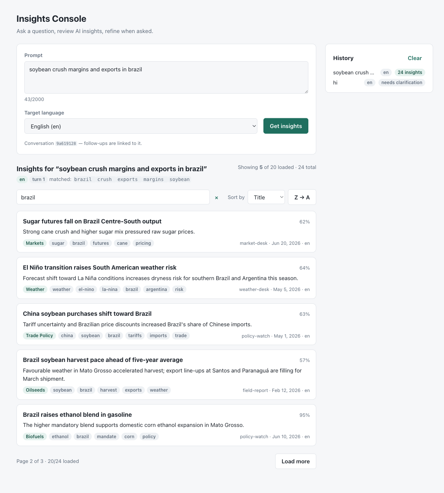

# Insights Console

UI client + middleware API (BFF) for an AI insights service. Fullstack coding assessment.

- `frontend/` React 19, TypeScript, Redux Toolkit / RTK Query, react-hook-form + zod, Vite, Vitest + Testing Library + msw
- `backend/` Python 3.12, FastAPI, pydantic v2, uv; in-memory stores over a local JSON catalogue; pytest



## Run

```bash
cd backend  && uv sync && uv run uvicorn app.main:app --reload --port 8000   # OpenAPI at /docs
cd frontend && pnpm install && pnpm dev                                        # :5173, /api proxied to :8000
```

`make dev` runs both; `docker compose up --build` serves the SPA on :8080 behind nginx with the API on :8000.

```bash
cd backend  && uv run pytest && uv run ruff check .
cd frontend && pnpm test && pnpm typecheck && pnpm lint
```

Try `soybean crush margins in brazil` (19 results, 2 pages), `wheat exports black sea`, `hi` or `do something` (clarification), or `targetLanguage: "xx"` via the API for a structured 400.

## Flow

1. The form validates shape with zod; submit is disabled until valid.
2. `POST /api/v1/prompts` validates strictly, then the gatekeeper decides before any AI call: prompts under 5 chars, single words, filler-only ("do something", "what is it?") or vague get `200 {status: "NEEDS_CLARIFICATION", message, reasons, suggestions, contextId, turn}`. The AI service is never invoked for these (spy-tested). Thresholds: `INSIGHTS_MIN_PROMPT_LENGTH`, `INSIGHTS_MIN_PROMPT_WORDS`.
3. Otherwise the BFF calls the `AIService` seam (a deterministic dummy ranked by keyword overlap), stores the result under a `requestId`, and returns `{status: "SUCCESS", ...page 1, pagination, meta}`.
4. Pages 2..n come from `GET /api/v1/prompts/{requestId}/insights?page=&pageSize=`. The client accumulates pages ("Load more") and searches/sorts the loaded set locally.
5. Every non-2xx body is `{error, message, details?}`: `422 VALIDATION_ERROR` (missing/empty/over-long prompt, bad UUID, unknown fields, bad `pageSize`), `400 INVALID_LANGUAGE`, `404 REQUEST_NOT_FOUND`, `413 PAYLOAD_TOO_LARGE`, `500 INTERNAL_ERROR`; framework 404/405 use the same envelope.

## API

| Method | Path | |
|---|---|---|
| `POST` | `/api/v1/prompts` | `{prompt, targetLanguage, contextId?}` → SUCCESS (page 1) or NEEDS_CLARIFICATION |
| `GET` | `/api/v1/prompts/{requestId}/insights?page=1&pageSize=10` | one page + pagination metadata |
| `GET` | `/api/v1/prompts/{requestId}?page=&pageSize=` | full answer envelope (not used by the SPA) |
| `GET` | `/api/v1/languages` | supported target languages |
| `GET` | `/api/v1/health` | liveness |

Pagination metadata is always present: `{page, pageSize, totalItems, totalPages, hasNextPage, hasPreviousPage}`.

## Architecture

Backend (`backend/app`):

```
api/routes/*      routers: validation + DI only
schemas.py        wire contracts (camelCase on the wire)
errors.py         AppError hierarchy, one error envelope for everything
domain/           models, PromptGatekeeper, paginate(); no framework imports
services/         AIService protocol + DummyAIService; PromptService orchestrates
repositories/     JsonInsightRepository, InMemoryRequestStore (TTL + LRU)
middleware.py     body-size guard;  chaos.py  opt-in fault injection
config.py         pydantic-settings, INSIGHTS_* env
main.py           create_app(settings, ai_service=...) wires everything
```

`PromptService` depends on the `RequestStore` protocol only; the in-memory implementation owns TTL/eviction. Page-size default/max are enforced in the service from injected settings, so tests can run with custom settings and nothing is read at import time.

Frontend (`frontend/src`):

```
app/                store factory, typed hooks, App shell
services/api/       RTK Query: baseApi + injected promptsApi / insightsApi / languagesApi, wire types, error normalisation
features/prompt/    PromptForm (zod + RHF), promptSlice, PromptOutcome, ConversationHistory
features/insights/  InsightsPanel, InsightsToolbar (debounced search, sort), InsightList/Card (memo), LoadMoreBar, insightsViewSlice
components/ui/      presentational only
i18n/               typed dictionaries en/es/fr/de, useT(), localeSlice, Intl formatters
lib/                pure filter/sort
hooks/              useDebouncedCallback
```

State: RTK Query owns server state (`submitPrompt` mutation, `getInsightsPages` infinite query, `getLanguages`). `promptSlice` holds every request/response pair (history, including rejected ones), the conversation `contextId`, and one discriminated `outcome`, filled by matchers on the mutation's actions. `insightsViewSlice` holds the debounced search term and sort. `localeSlice` holds the UI locale.

## Decisions

- Pagination is done in the BE; search/sort in the FE over the loaded set ("Load more"). The count line shows loaded vs total so that is never ambiguous. Server-side `q`/`sort` would replace `lib/insightFilters.ts` with query params.
- The POST already returns page 1, so `onQueryStarted` seeds the infinite-query cache with `upsertQueryData`; "Load more" starts at page 2. A test asserts no `GET …/insights` before Load more.
- Raw search input is local state; only the debounced value reaches the store. List, card, toolbar and load-more bar are memoised; the visible list is derived with `useMemo`; `filterInsights` returns the same array for an empty term.
- `NEEDS_CLARIFICATION` is HTTP 200 (a business outcome, not a client error). `400 INVALID_LANGUAGE` for any code outside the supported set; `422 VALIDATION_ERROR` for malformed bodies.
- zod validates shape; the BFF decides meaning (length/context), so the rule lives in one place.
- TypeScript rather than plain JS.
- `contextId` is created by the BFF on first contact, echoed on clarification, carried by the client on follow-ups; each submission increments the context's `turn`.
- Single-word prompts still get a clarification request (`min_prompt_words=2`, env-tunable).
- Error alerts have Dismiss (clears the outcome only); "Start a new conversation" drops the `contextId`; history is a log and is cleared separately. Ctrl/Cmd+Enter submits from the textarea. A render error inside an answer is contained by an error boundary rather than blanking the page; the character counter stays visible (flagged) when the prompt is over the limit; long unbroken prompts wrap.
- `DummyAIService` ranks the 48-item catalogue by keyword overlap across all four languages and falls back to a deterministic sample, so the same prompt always paginates the same way. Each entry carries en/es/fr/de title, content and category; `localized(targetLanguage)` returns the right one (tags/source stay machine identifiers).

## Localization

The selected target language drives everything: UI copy (`src/i18n/`, `en` is the source of truth and the other locales are typed against it; `{param}` interpolation and `Intl.PluralRules` plurals), zod messages, error titles by code, `Intl` date/percent/collation, `<html lang>` and the title; insight content and categories from the BFF; and the BFF's clarification `message`/`suggestions`. `reasons` and `error` codes stay machine-readable.

## Contract check

`make contract` exports the OpenAPI document to `frontend/src/test/openapi.json`. `backend/tests/test_openapi_snapshot.py` fails when it is stale; `frontend/src/test/contract.test.ts` validates the UI mocks (typed against `services/api/types.ts`) against those schemas with Ajv. A renamed field on either side fails one of the two.

## Hardening

Body-size cap (413, before parsing); bounded `page`/`pageSize`; LRU + TTL on the request and turn stores; one error envelope (no stack traces); CORS allow-list without credentials; nginx `nosniff`, `X-Frame-Options`, CSP, `Referrer-Policy`, `client_max_body_size`; non-root containers; backend healthcheck gates the frontend in compose. No auth; `requestId` (UUIDv4) is the only handle to a result.

Client: 15 s request timeout; transient failures (network, timeout, 502/503/504) retried with backoff for queries only, never for the POST; gateway errors mapped to `SERVER_UNAVAILABLE`.

## Stress and chaos

See [docs/stress-and-chaos.md](docs/stress-and-chaos.md): `make stress` (scenario generator), `oha` numbers (1 worker ~2.3k POST/s, 4 workers ~7.7k), the CPU hot path it exposed (search index now precomputed at load), the multi-worker / in-memory-store finding, `make chaos` (fault injection), fuzz tests, and UI behaviour with a flaky, dead or restarted BFF.

## Tests

Backend 109 (pytest): validation and error envelopes, gatekeeper, clarification short-circuit with a spy AI, pagination and page bounds, body-size guard, store TTL/LRU, localization, chaos middleware, ~360 fuzz cases, OpenAPI snapshot. Frontend 58 (vitest): filter/sort, debounce, error mapping, slice matchers, form gating, SUCCESS/clarification/4xx rendering, no page-1 refetch, load more and its failure, search/sort, i18n key parity and whole-UI switch, contract, retry/timeout classification, UI edge cases (whitespace prompt, over-limit counter, Ctrl+Enter, dismiss vs new conversation, invalid dates, error boundary).

## Next

- Persist the request store (Redis/SQL) behind `RequestStore`; required for multi-worker deployments (see stress doc).
- Server-side `q`/`sort`, virtualised list for large result sets.
- Auth, rate limiting, request-id logging.
